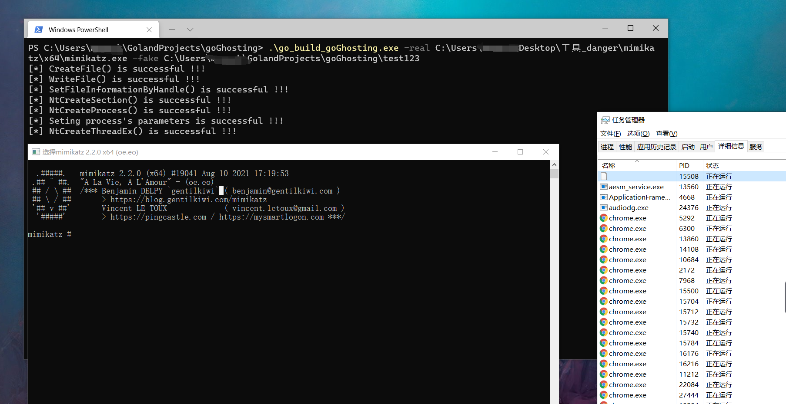

# goGhosting

Process Ghosting (x64 only) in Golang.
https://www.elastic.co/blog/process-ghosting-a-new-executable-image-tampering-attack

## Compile options

1. Enter the project directory.
2. Run `go build`.

## Usage

```text
PS C:\> .\Path\to\goGhosting.exe -real C:\windows\system32\cmd.exe -fake C:\windows\temp\fakefile
```



## Super helpful projects

```text
https://github.com/Wra7h/SharpGhosting
https://github.com/hasherezade/process_ghosting
```
